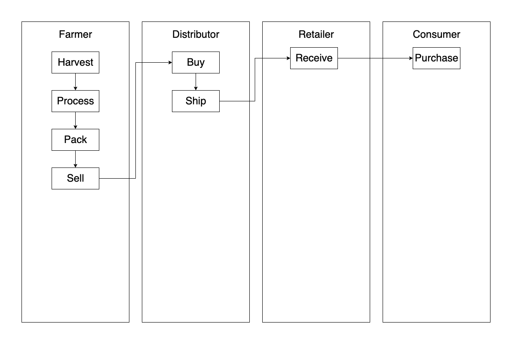
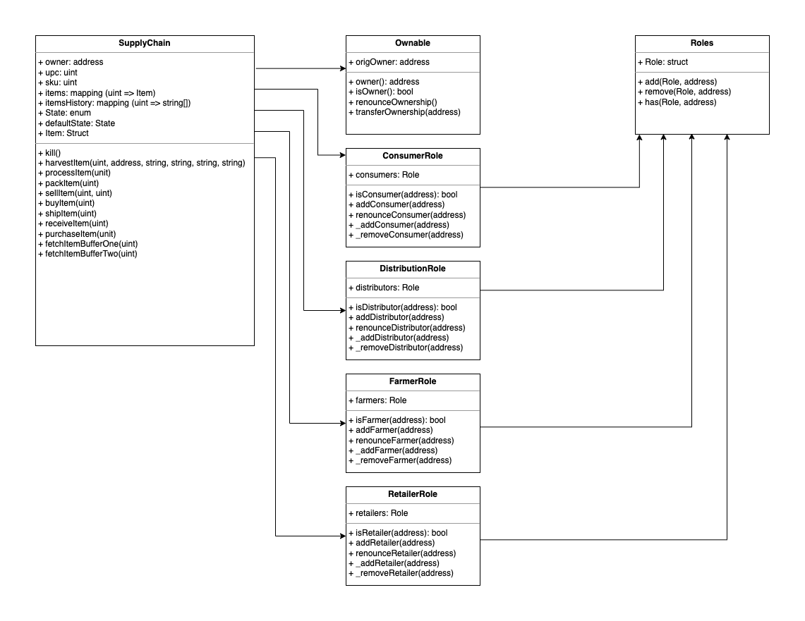
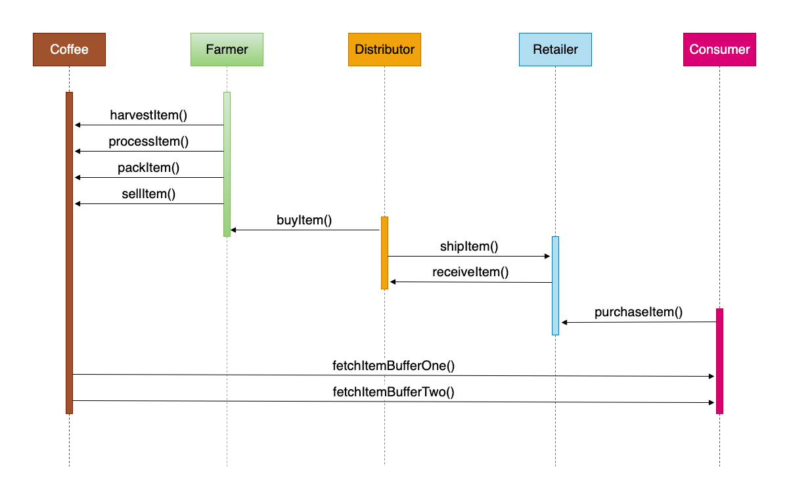
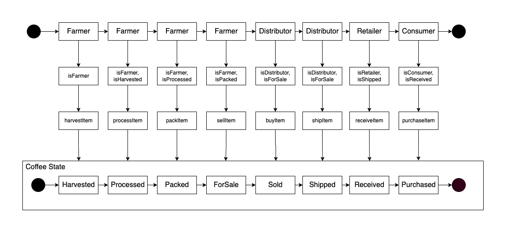
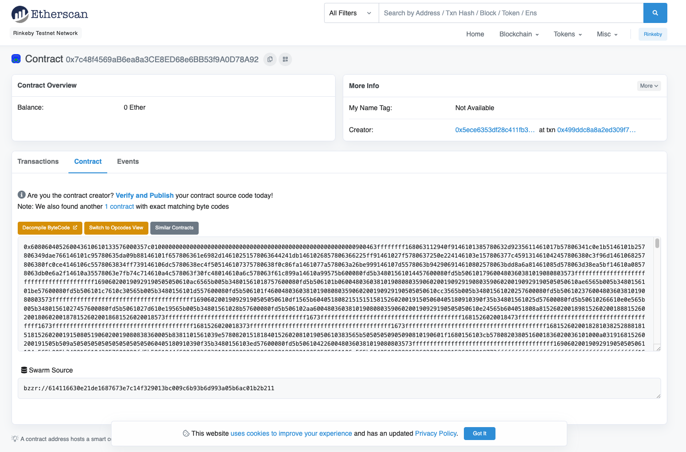
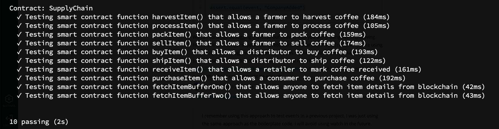

# Supply chain & data auditing

This repository containts an Ethereum DApp that demonstrates a Supply Chain flow between a Seller and Buyer. The user story is similar to any commonly used supply chain process. A Seller can add items to the inventory system stored in the blockchain. A Buyer can purchase such items from the inventory system. Additionally a Seller can mark an item as Shipped, and similarly a Buyer can mark an item as Received.

## UML

### Activity Diagram



### Data Model Diagram



### Sequence Diagram



### State Diagram



## Libraries

- [@truffle/hdwallet-provider](https://www.npmjs.com/package/@truffle/hdwallet-provider)

## IPFS

IPFS was not used for this project

## Contract Addresses

| Contract        | Address                                    |
| --------------- | ------------------------------------------ |
| FarmerRole      | 0x076fc6f2d93a83b2af630b530b42921c2c8b1229 |
| DistributorRole | 0x16c079f0548928f31bf82fb17066771688ebeedc |
| RetailerRole    | 0x29dace95eff143d43024e971a6e2f7216ae8ae76 |
| ConsumerRole    | 0xd5ae647afe0b2df0084951409c52b0ce5da8faab |
| SupplyChain     | 0x7c48f4569ab6ea8a3ce8ed68e6bb53f9a0d78a92 |

[Contract address on Rinkeby test network (Etherscan)](https://rinkeby.etherscan.io/address/0x7c48f4569ab6ea8a3ce8ed68e6bb53f9a0d78a92)



## Transaction IDs

| Contract        | Transaction ID                                                     |
| --------------- | ------------------------------------------------------------------ |
| FarmerRole      | 0x630e577ca5e15d4d0741156f8ac3331544c22e6d91b3638c4e9b0126b3a6b89f |
| DistributorRole | 0x95268bc17869f37f84299b844f2854d6c5ab58bab416567b5a1befdb0940edd1 |
| RetailerRole    | 0x8b2c33e7c407c6c7a6bf480e7d6637a8bfeb1e83399bbd8f1c8126a20d0d2cce |
| ConsumerRole    | 0x4298d825e1cb9c86921413c65b30ff87fc752f28c178c538314f58cded171c1e |
| SupplyChain     | 0x499ddc8a8a2ed309f7c1a94db64b986cd88f43a9faa0611c95b2cdfcac68b593 |

## Test Coverage



## Version Numbers

| Program  | Version |
| -------- | ------- |
| node     | 10.9.0  |
| truffle  | 4.1.14  |
| solidity | 0.4.24  |
| web3     | 1.2.1   |

## Getting Started

These instructions will get you a copy of the project up and running on your local machine for development and testing purposes. See deployment for notes on how to deploy the project on a live system.

### Prerequisites

Please make sure you've already installed ganache-cli, Truffle and enabled MetaMask extension in your browser.

```
Give examples (to be clarified)
```

### Installing

> The starter code is written for **Solidity v0.4.24**. At the time of writing, the current Truffle v5 comes with Solidity v0.5 that requires function _mutability_ and _visibility_ to be specified (please refer to Solidity [documentation](https://docs.soliditylang.org/en/v0.5.0/050-breaking-changes.html) for more details). To use this starter code, please run `npm i -g truffle@4.1.14` to install Truffle v4 with Solidity v0.4.24.

A step by step series of examples that tell you have to get a development env running

Clone this repository:

```
git clone https://github.com/udacity/nd1309/tree/master/course-5/project-6
```

Change directory to `project-6` folder and install all requisite npm packages (as listed in `package.json`):

```
cd project-6
npm install
```

Launch Ganache:

```
ganache-cli -m "spirit supply whale amount human item harsh scare congress discover talent hamster"
```

Your terminal should look something like this:


In a separate terminal window, Compile smart contracts:

```
truffle compile
```

Your terminal should look something like this:


This will create the smart contract artifacts in folder `build\contracts`.

Migrate smart contracts to the locally running blockchain, ganache-cli:

```
truffle migrate
```

Your terminal should look something like this:


Test smart contracts:

```
truffle test
```

All 10 tests should pass.


In a separate terminal window, launch the DApp:

```
npm run dev
```

## Built With

- [Ethereum](https://www.ethereum.org/) - Ethereum is a decentralized platform that runs smart contracts
- [IPFS](https://ipfs.io/) - IPFS is the Distributed Web | A peer-to-peer hypermedia protocol
  to make the web faster, safer, and more open.
- [Truffle Framework](http://truffleframework.com/) - Truffle is the most popular development framework for Ethereum with a mission to make your life a whole lot easier.

## Authors

See also the list of [contributors](https://github.com/your/project/contributors.md) who participated in this project.

## Acknowledgments

- Solidity
- Ganache-cli
- Truffle
- IPFS
